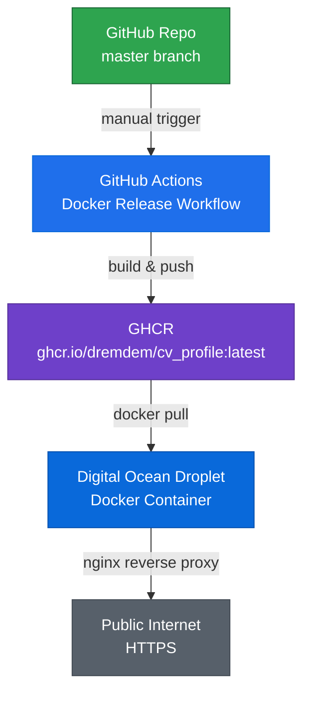

# Deployment Guide for Digital Ocean

This guide describes the complete deployment workflow for the CV Profile application, from building Docker images to deploying on a Digital Ocean droplet.

## Table of Contents

- [Overview](#overview)
- [Prerequisites](#prerequisites)
- [CI/CD Workflow](#cicd-workflow)
- [Part 1: Prepare Digital Ocean Droplet](#part-1-prepare-digital-ocean-droplet)
- [Part 2: Pull Docker Image from GHCR](#part-2-pull-docker-image-from-ghcr)
- [Part 3: Configure nginx](#part-3-configure-nginx)
- [Part 4: Set Up SSL with Let's Encrypt](#part-4-set-up-ssl-with-lets-encrypt)
- [Part 5: Manage the Application](#part-5-manage-the-application)
- [Troubleshooting](#troubleshooting)

---

## Overview

**Deployment Architecture:**



**Key Principles:**
- ✅ Build from `master` branch only (production-ready code)
- ✅ Images pushed to GitHub Container Registry (GHCR)
- ✅ Manual deployment trigger for control
- ✅ Immutable Docker images with semantic versioning

---

## Prerequisites

- A Digital Ocean droplet running Ubuntu 20.04+ or Debian 11+
- Root or sudo access to the droplet
- A domain name pointing to your droplet's IP address
- GitHub account with access to the cv_profile repository
- Write permissions to the repository (for triggering workflows)

---

## CI/CD Workflow

### Build from Master Only

**Important:** Docker images should only be built from the `master` branch to ensure production deployments use stable, reviewed code.

### Step 1: Trigger Docker Build

The project uses GitHub Actions to build and push Docker images to GHCR (GitHub Container Registry).

**To trigger a build:**

1. Navigate to the repository on GitHub
2. Go to **Actions** tab
3. Select **"Docker Release"** workflow from the left sidebar
4. Click **"Run workflow"** dropdown button
5. **Ensure `master` branch is selected**
6. Click **"Run workflow"** button

**Workflow File:** `.github/workflows/docker-release.yml`

### Step 2: Monitor Build Progress

1. The workflow will appear in the Actions tab
2. Click on the running workflow to see build logs
3. Wait for all steps to complete (typically 2-5 minutes)
4. Verify ✅ green checkmark appears

**Build Steps:**
- Checkout repository code
- Set up Docker Buildx
- Log in to GHCR
- Extract Docker metadata
- Build multi-platform image (linux/amd64)
- Push image to `ghcr.io/dremdem/cv_profile:latest`
- Verify and cache

### Step 3: Verify Image in GHCR

After successful build:

1. Go to repository main page
2. Click **"Packages"** on the right sidebar
3. You should see `cv_profile` package
4. Click on it to see image details and tags

**Image URL:**
```
ghcr.io/dremdem/cv_profile:latest
```

### Workflow Configuration

The Docker Release workflow (`docker-release.yml`):

```yaml
on:
  workflow_dispatch:  # Manual trigger only

env:
  REGISTRY: ghcr.io
  IMAGE_NAME: dremdem/cv_profile

jobs:
  build-and-push:
    runs-on: ubuntu-latest
    permissions:
      contents: read
      packages: write
      id-token: write
```

**Key Features:**
- ✅ Manual dispatch (controlled deployment)
- ✅ Pushes to GHCR automatically
- ✅ Uses GitHub Actions cache for faster builds
- ✅ Tags image as `latest`
- ✅ Includes metadata (title, description, revision)

### Best Practices

1. **Always build from master**
   - Merge PRs to master first
   - Run workflow from master branch only
   - Never build from feature branches for production

2. **Verify before deploying**
   - Check build logs for errors
   - Confirm image appears in GHCR
   - Test locally if possible: `docker pull ghcr.io/dremdem/cv_profile:latest`

3. **Deployment sequence**
   ```
   1. Merge PR to master
   2. Trigger Docker Release workflow
   3. Wait for build completion
   4. Pull image on droplet
   5. Restart container
   6. Verify deployment
   ```

### Automated Deployment Options

**Option A: Manual (Current)**
- Trigger workflow manually
- SSH to droplet and pull new image
- Restart container

**Option B: Watchtower (Semi-Automated)**
- Install Watchtower on droplet (see Part 5.3)
- Watchtower checks for new images hourly
- Automatically pulls and restarts

**Option C: GitHub Actions CD (Fully Automated)**
- Add deployment step to workflow
- Use SSH action to update droplet
- Requires SSH key setup in GitHub Secrets

---

## Part 1: Prepare Digital Ocean Droplet

### 1.1 Connect to Your Droplet

```bash
ssh root@your-droplet-ip
```

### 1.2 Update System Packages

```bash
apt update && apt upgrade -y
```

### 1.3 Install Docker

```bash
# Install dependencies
apt install -y apt-transport-https ca-certificates curl software-properties-common

# Add Docker's official GPG key
curl -fsSL https://download.docker.com/linux/ubuntu/gpg | apt-key add -

# Add Docker repository
add-apt-repository "deb [arch=amd64] https://download.docker.com/linux/ubuntu $(lsb_release -cs) stable"

# Install Docker
apt update
apt install -y docker-ce docker-ce-cli containerd.io

# Start and enable Docker
systemctl start docker
systemctl enable docker

# Verify installation
docker --version
```

### 1.4 Install Docker Compose (Optional)

```bash
curl -L "https://github.com/docker/compose/releases/latest/download/docker-compose-$(uname -s)-$(uname -m)" -o /usr/local/bin/docker-compose
chmod +x /usr/local/bin/docker-compose
docker-compose --version
```

### 1.5 Install nginx

```bash
apt install -y nginx
systemctl start nginx
systemctl enable nginx

# Verify installation
nginx -v
```

### 1.6 Configure Firewall

```bash
# Allow SSH, HTTP, and HTTPS
ufw allow OpenSSH
ufw allow 'Nginx Full'
ufw enable
ufw status
```

---

## Part 2: Pull Docker Image from GHCR

### 2.1 Authenticate with GitHub Container Registry

```bash
# Create a GitHub Personal Access Token (PAT) with `read:packages` scope
# Go to: https://github.com/settings/tokens

# Login to GHCR
echo "YOUR_GITHUB_TOKEN" | docker login ghcr.io -u YOUR_GITHUB_USERNAME --password-stdin
```

### 2.2 Pull the Docker Image

```bash
# Pull the latest image
docker pull ghcr.io/dremdem/cv_profile:latest

# Verify the image was pulled
docker images | grep cv_profile
```

### 2.3 Run the Docker Container

```bash
# Run the container
docker run -d \
  --name cv-profile \
  --restart unless-stopped \
  -p 127.0.0.1:3000:3000 \
  ghcr.io/dremdem/cv_profile:latest

# Verify the container is running
docker ps | grep cv-profile

# Check logs
docker logs cv-profile
```

**Note**: We bind to `127.0.0.1:3000` so the application is only accessible via nginx reverse proxy.

---

## Part 3: Configure nginx

### 3.1 Create nginx Configuration

Create a new nginx configuration file for your site:

```bash
nano /etc/nginx/sites-available/cv-profile
```

Add the following configuration (replace `yourdomain.com` with your actual domain):

```nginx
# HTTP server - redirects to HTTPS
server {
    listen 80;
    listen [::]:80;
    server_name yourdomain.com www.yourdomain.com;

    # Redirect all HTTP requests to HTTPS
    return 301 https://$server_name$request_uri;
}

# HTTPS server
server {
    listen 443 ssl http2;
    listen [::]:443 ssl http2;
    server_name yourdomain.com www.yourdomain.com;

    # SSL certificates (will be configured with Let's Encrypt)
    ssl_certificate /etc/letsencrypt/live/yourdomain.com/fullchain.pem;
    ssl_certificate_key /etc/letsencrypt/live/yourdomain.com/privkey.pem;

    # SSL configuration
    ssl_protocols TLSv1.2 TLSv1.3;
    ssl_ciphers HIGH:!aNULL:!MD5;
    ssl_prefer_server_ciphers on;
    ssl_session_cache shared:SSL:10m;
    ssl_session_timeout 10m;

    # Security headers
    add_header X-Frame-Options "SAMEORIGIN" always;
    add_header X-Content-Type-Options "nosniff" always;
    add_header X-XSS-Protection "1; mode=block" always;
    add_header Referrer-Policy "no-referrer-when-downgrade" always;

    # Logs
    access_log /var/log/nginx/cv-profile-access.log;
    error_log /var/log/nginx/cv-profile-error.log;

    # Proxy settings
    location / {
        proxy_pass http://127.0.0.1:3000;
        proxy_http_version 1.1;
        proxy_set_header Upgrade $http_upgrade;
        proxy_set_header Connection 'upgrade';
        proxy_set_header Host $host;
        proxy_cache_bypass $http_upgrade;
        proxy_set_header X-Real-IP $remote_addr;
        proxy_set_header X-Forwarded-For $proxy_add_x_forwarded_for;
        proxy_set_header X-Forwarded-Proto $scheme;

        # Timeouts
        proxy_connect_timeout 60s;
        proxy_send_timeout 60s;
        proxy_read_timeout 60s;
    }

    # Static files caching
    location /_next/static {
        proxy_pass http://127.0.0.1:3000;
        proxy_cache_valid 200 60m;
        add_header Cache-Control "public, max-age=3600, immutable";
    }

    # Favicon and static assets
    location ~* \.(ico|css|js|gif|jpeg|jpg|png|svg|woff|woff2|ttf|eot)$ {
        proxy_pass http://127.0.0.1:3000;
        expires 1y;
        add_header Cache-Control "public, immutable";
    }
}
```

### 3.2 Enable the Site

```bash
# Create symbolic link
ln -s /etc/nginx/sites-available/cv-profile /etc/nginx/sites-enabled/

# Test nginx configuration
nginx -t

# If test passes, reload nginx
systemctl reload nginx
```

### 3.3 Temporary HTTP-only Configuration (Before SSL)

If you haven't set up SSL yet, use this simpler configuration first:

```nginx
server {
    listen 80;
    listen [::]:80;
    server_name yourdomain.com www.yourdomain.com;

    access_log /var/log/nginx/cv-profile-access.log;
    error_log /var/log/nginx/cv-profile-error.log;

    location / {
        proxy_pass http://127.0.0.1:3000;
        proxy_http_version 1.1;
        proxy_set_header Upgrade $http_upgrade;
        proxy_set_header Connection 'upgrade';
        proxy_set_header Host $host;
        proxy_cache_bypass $http_upgrade;
        proxy_set_header X-Real-IP $remote_addr;
        proxy_set_header X-Forwarded-For $proxy_add_x_forwarded_for;
        proxy_set_header X-Forwarded-Proto $scheme;
    }
}
```

---

## Part 4: Set Up SSL with Let's Encrypt

### 4.1 Install Certbot

```bash
apt install -y certbot python3-certbot-nginx
```

### 4.2 Obtain SSL Certificate

```bash
# Run certbot (it will automatically configure nginx)
certbot --nginx -d yourdomain.com -d www.yourdomain.com

# Follow the prompts:
# - Enter your email address
# - Agree to terms of service
# - Choose whether to redirect HTTP to HTTPS (recommended: Yes)
```

### 4.3 Test Auto-Renewal

```bash
# Dry run to test renewal
certbot renew --dry-run

# Certbot automatically sets up a cron job for renewal
# Check the timer
systemctl status certbot.timer
```

### 4.4 Update nginx Configuration

After obtaining the SSL certificate, update your nginx configuration to use the full HTTPS configuration from section 3.1 above, then reload nginx:

```bash
nginx -t
systemctl reload nginx
```

---

## Part 5: Manage the Application

### 5.1 Update the Application

When a new version is released:

```bash
# Pull the latest image
docker pull ghcr.io/dremdem/cv_profile:latest

# Stop and remove the old container
docker stop cv-profile
docker rm cv-profile

# Start the new container
docker run -d \
  --name cv-profile \
  --restart unless-stopped \
  -p 127.0.0.1:3000:3000 \
  ghcr.io/dremdem/cv_profile:latest

# Verify
docker ps | grep cv-profile
docker logs cv-profile
```

### 5.2 Using Docker Compose (Alternative)

Create a `docker-compose.yml` file:

```yaml
version: '3.8'

services:
  cv-profile:
    image: ghcr.io/dremdem/cv_profile:latest
    container_name: cv-profile
    restart: unless-stopped
    ports:
      - "127.0.0.1:3000:3000"
    environment:
      - NODE_ENV=production
    logging:
      driver: "json-file"
      options:
        max-size: "10m"
        max-file: "3"
```

Then manage with:

```bash
# Start
docker-compose up -d

# Update
docker-compose pull
docker-compose up -d

# Stop
docker-compose down

# View logs
docker-compose logs -f
```

### 5.3 Automated Updates with Watchtower (Optional)

Install Watchtower to automatically update containers:

```bash
docker run -d \
  --name watchtower \
  --restart unless-stopped \
  -v /var/run/docker.sock:/var/run/docker.sock \
  containrrr/watchtower \
  --interval 3600 \
  --cleanup \
  cv-profile
```

This will check for updates every hour and automatically update the `cv-profile` container.

### 5.4 Monitoring

```bash
# Check container status
docker ps -a

# View logs
docker logs cv-profile
docker logs -f cv-profile  # Follow logs

# Check resource usage
docker stats cv-profile

# Check nginx status
systemctl status nginx

# View nginx logs
tail -f /var/log/nginx/cv-profile-access.log
tail -f /var/log/nginx/cv-profile-error.log
```

---

## Troubleshooting

### Application Not Accessible

1. Check if the container is running:
   ```bash
   docker ps | grep cv-profile
   ```

2. Check container logs:
   ```bash
   docker logs cv-profile
   ```

3. Verify the application is listening:
   ```bash
   curl http://localhost:3000
   ```

4. Check nginx configuration:
   ```bash
   nginx -t
   ```

5. Check nginx logs:
   ```bash
   tail -f /var/log/nginx/cv-profile-error.log
   ```

### SSL Certificate Issues

1. Check certificate validity:
   ```bash
   certbot certificates
   ```

2. Manually renew certificate:
   ```bash
   certbot renew
   ```

3. Check certificate files exist:
   ```bash
   ls -la /etc/letsencrypt/live/yourdomain.com/
   ```

### Docker Image Pull Issues

1. Verify authentication:
   ```bash
   docker login ghcr.io
   ```

2. Check if image exists:
   ```bash
   docker pull ghcr.io/dremdem/cv_profile:latest
   ```

3. Check package visibility in GitHub (must be public or you need proper access)

### Port Already in Use

If port 3000 is already in use:

```bash
# Find what's using the port
lsof -i :3000

# Use a different port
docker run -d \
  --name cv-profile \
  --restart unless-stopped \
  -p 127.0.0.1:3001:3000 \
  ghcr.io/dremdem/cv_profile:latest

# Update nginx proxy_pass to use the new port
```

### Container Keeps Restarting

```bash
# Check logs for errors
docker logs cv-profile

# Check if port is available
netstat -tuln | grep 3000

# Run container in interactive mode for debugging
docker run -it --rm -p 127.0.0.1:3000:3000 ghcr.io/dremdem/cv_profile:latest
```

---

## Additional Resources

- [Docker Documentation](https://docs.docker.com/)
- [nginx Documentation](https://nginx.org/en/docs/)
- [Let's Encrypt Documentation](https://letsencrypt.org/docs/)
- [Digital Ocean Tutorials](https://www.digitalocean.com/community/tutorials)

---

## Security Best Practices

1. **Keep system updated**: Regularly run `apt update && apt upgrade`
2. **Use strong passwords**: For server access and GitHub tokens
3. **Enable firewall**: Use UFW to restrict access
4. **Regular backups**: Back up nginx configurations and SSL certificates
5. **Monitor logs**: Regularly check application and nginx logs
6. **Rotate tokens**: Periodically rotate GitHub Personal Access Tokens
7. **Limit container resources**: Use Docker resource limits if needed
8. **Use non-root user**: The Dockerfile already uses a non-root user

---

**Last Updated**: 2025-12-03
**Version**: 1.0
